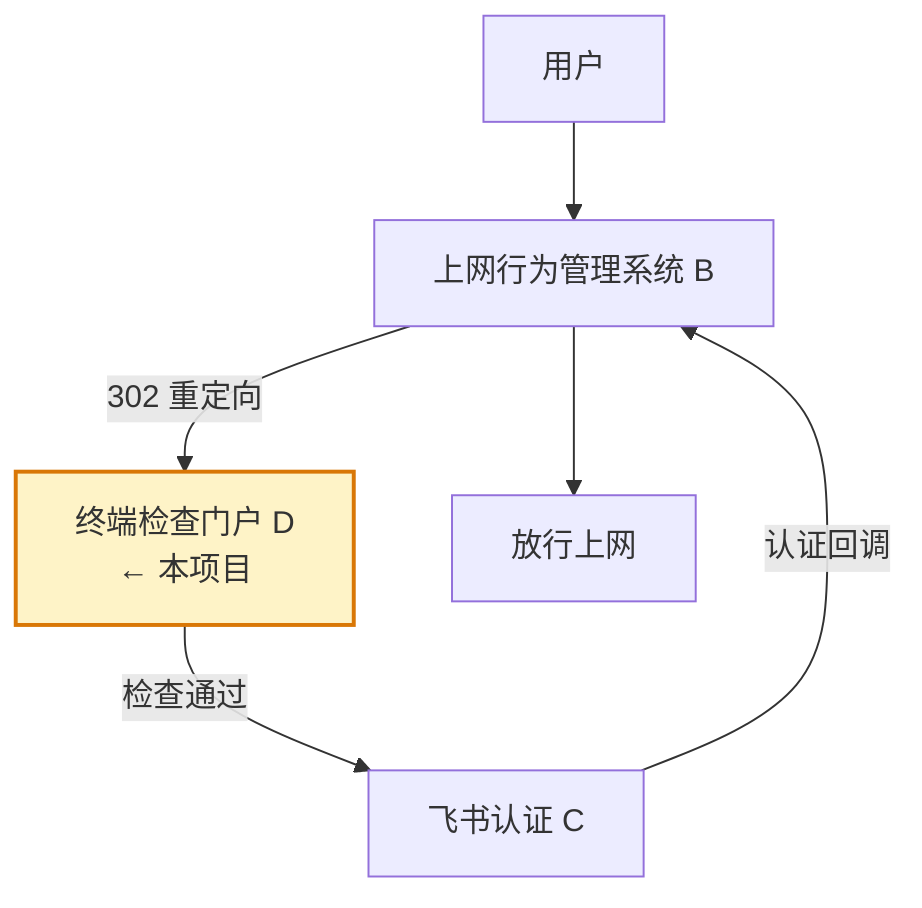
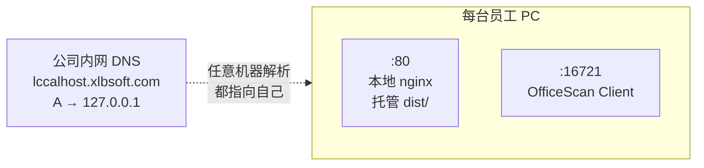
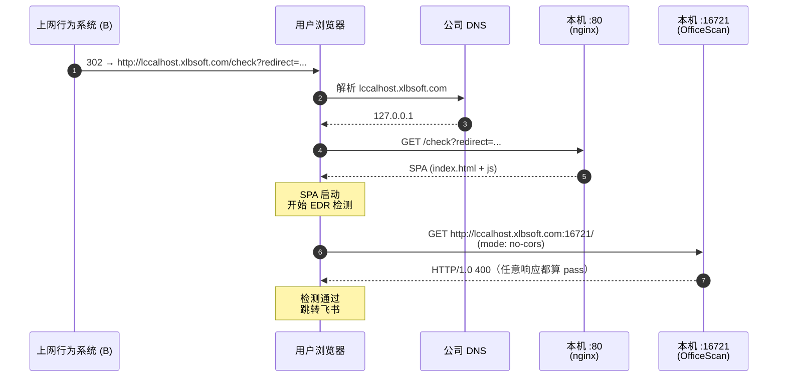
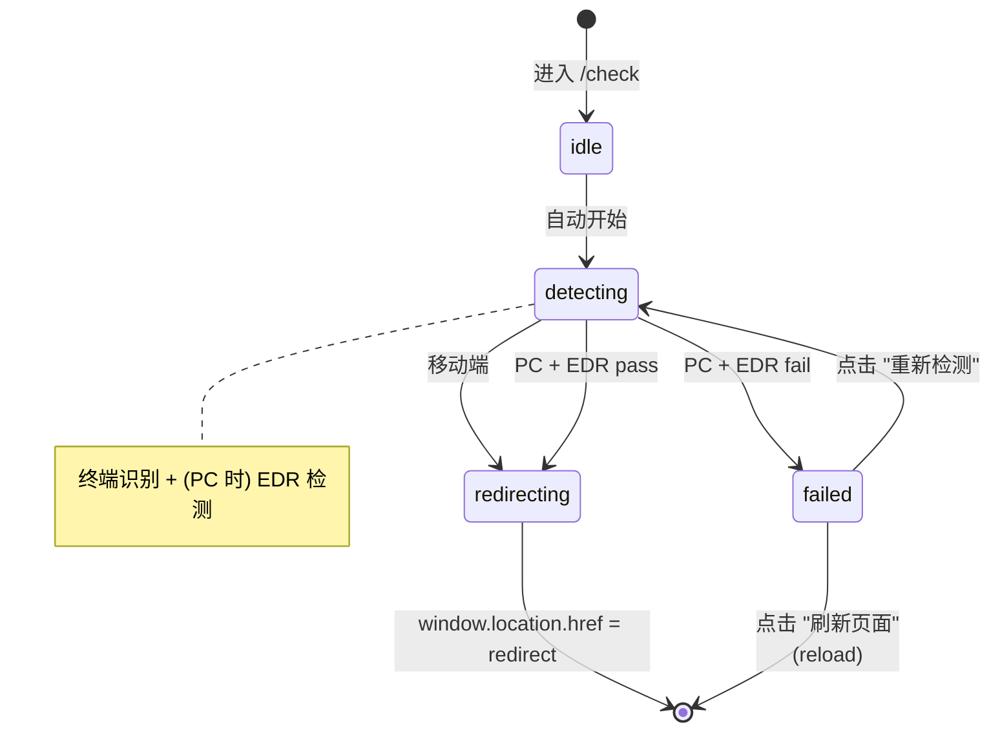
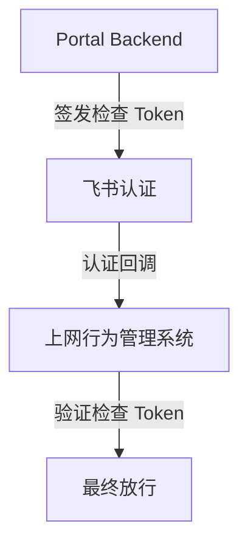

# EDR 预认证检查门户 (Pre-Authentication Check Portal)

> 挂在飞书认证之前、对 PC 终端做 EDR 合规检查的纯前端门户。
> 检查通过 → 跳转飞书认证；失败 → 阻断并提示安装/启动 EDR。

## 目录

1. [项目定位](#1-项目定位)
2. [MVP 范围](#2-mvp-范围)
3. [技术栈](#3-技术栈)
4. [部署架构（关键前提）](#4-部署架构关键前提)
5. [路由设计](#5-路由设计)
6. [业务流程（状态机）](#6-业务流程状态机)
7. [终端识别](#7-终端识别)
8. [EDR 检测方案](#8-edr-检测方案)
9. [页面 / 组件](#9-页面--组件)
10. [目录结构](#10-目录结构)
11. [本地开发与调试](#11-本地开发与调试)
12. [测试矩阵](#12-测试矩阵)
13. [构建与部署](#13-构建与部署)
14. [后续规划](#14-后续规划)

---

## 1. 项目定位

本项目是认证链路中的 **D 系统**，负责在用户进入飞书认证之前对终端做安全合规检查。



**D 系统职责**

- 判断终端是 PC 还是移动端
- PC 端：检测企业 EDR（亚信安全 OfficeScan Client）是否在运行
- 通过 → 跳转飞书认证 URL
- 失败 → 显示阻断页，提示用户安装或启动 EDR

---

## 2. MVP 范围

| 包含                              | 不包含（留给后续生产版本） |
| --------------------------------- | -------------------------- |
| PC / 移动端判断                   | 服务端校验                 |
| OfficeScan 端口检测（PC 端）      | Token 签发                 |
| 失败阻断页                        | 状态存储                   |
| 跳转飞书认证                      | 审计日志、用户管理         |
|                                   | 任何后端依赖               |

---

## 3. 技术栈

| 类型     | 选型                  |
| -------- | --------------------- |
| 框架     | React 18 + TypeScript |
| 构建     | Vite                  |
| 路由     | react-router-dom v6   |
| 样式     | Tailwind CSS          |
| 部署形态 | 纯静态 SPA（无后端）  |
| 包管理器 | npm                   |

**实现原则**

1. 函数组件 + Hooks
2. 不引入重量级状态管理（`useState` / `useReducer` 足够）
3. 所有检测逻辑、浏览器判断封装为独立模块（`src/lib/`）
4. 所有状态用 TypeScript 类型显式定义
5. 优先保证兼容性与稳定性，而非炫酷效果

---

## 4. 部署架构（关键前提）

> ⚠️ 本项目的部署模型**不是**"中心化托管 SPA"，而是 **每台 PC 本地托管 + 公司 DNS 解析到本机**。理解这一点是看懂后面所有 fetch URL 的前提。

### 4.1 DNS 与本机布局



### 4.2 用户访问链路



### 4.3 为什么这么设计

- 门户和 EDR 端口 **同协议（HTTP）同 host**，避免 HTTPS → HTTP 的 **mixed content** 拦截。
- 不在 URL 里直接写 `127.0.0.1`，对用户更友好，也方便后续如需 TLS 时申请域名证书。

> ⚠️ 门户**必须**用 HTTP，不能升级到 HTTPS，否则浏览器会拦截到本地 HTTP 端口的请求。

---

## 5. 路由设计

使用 `react-router-dom`：

| 路径      | 组件             | 说明                                                      |
| --------- | ---------------- | --------------------------------------------------------- |
| `/check`  | `CheckPage`      | 入口，承接 `?redirect=<feishu_url>`，执行检测主流程       |
| `/failed` | `FailedPage`     | 检查失败的阻断页（"重新检测"会跳回 `/check`）             |
| `*`       | 重定向到 `/check` | 兜底                                                      |

### URL 参数

- `redirect`（必填）：飞书认证 URL
  - **MVP 不做白名单校验**，原样执行 `window.location.href = redirect`
  - 缺失时：显示静态错误"参数 redirect 缺失"，**不进入检测流程**

---

## 6. 业务流程（状态机）



**关键决策点**

| 终端       | EDR 检测 | 结果         |
| ---------- | -------- | ------------ |
| 移动端     | 跳过     | 直接跳飞书   |
| PC + 通过  | 执行     | 直接跳飞书   |
| PC + 失败  | 执行     | 进 `/failed` |

---

## 7. 终端识别

### 7.1 目标类型

```typescript
// src/lib/runtime.ts
export interface RuntimeInfo {
  isPC: boolean
  isMobile: boolean
  isFeishu: boolean   // 仅作环境标识，不参与 PC/移动端判断
}

export function detectRuntime(): RuntimeInfo
```

### 7.2 判断原则

不能只依赖 `navigator.userAgent`。结合以下信号综合判断：

```typescript
navigator.userAgent
navigator.userAgentData                  // Chromium 系
navigator.maxTouchPoints                 // 触屏数量
window.matchMedia('(pointer: coarse)')   // 粗指针（手指）
window.matchMedia('(hover: none)')       // 不支持 hover
```

**规则**：移动端特征明显 → `Mobile`，否则 → `PC`。无需识别具体品牌型号。

### 7.3 飞书环境识别

```typescript
const isFeishu = /Lark|Feishu|LarkLocale|Lark\/|Feishu\//i.test(navigator.userAgent)
```

> ⚠️ 飞书 PC 客户端也有内置浏览器，所以 `isFeishu === true` **不等于**移动端。`isFeishu` 仅用于环境标识、调试日志。

---

## 8. EDR 检测方案

### 8.1 检测目标

```
GET http://lccalhost.xlbsoft.com:16721/
```

### 8.2 已验证事实

| 项               | 值                                                            |
| ---------------- | ------------------------------------------------------------- |
| 企业 EDR         | 亚信安全 OfficeScan Client                                    |
| Windows 服务名   | `tmlisten` / `OfficeScan NT Listener`                         |
| 程序路径         | `C:\Program Files\Asiainfo Security\OfficeScan Client\tmlisten.exe` |
| 监听端口         | `127.0.0.1:16721`                                             |
| `curl` 返回      | `HTTP/1.0 400 Bad Request` + `Server: OfficeScan Client`      |

只要能拿到 **任意** HTTP 响应（含 400），就说明 OfficeScan 在跑。

### 8.3 浏览器侧实现要点（必读）

浏览器**无法**直接探测 TCP 端口，只能通过 `fetch`。规范上有三条硬约束：

1. **跨端口属于跨源** → 必须用 `mode: 'no-cors'`，否则 fetch 因 CORS 失败。
2. **`no-cors` 下 Response 是 opaque** → `status` 永远是 `0`，**无法读任何 header**（包括 `Server: OfficeScan Client`）。
3. **因此判断标准只能是 "promise 是否 reject"**：

   | 结果              | 含义                              | 判定 |
   | ----------------- | --------------------------------- | ---- |
   | resolve           | TCP 握手 + HTTP 解析成功          | pass |
   | reject TypeError  | 连接被拒 / DNS 失败 / 网络错误    | fail |
   | reject AbortError | 超时                              | fail |

> ⚠️ **不要**写 `if (resp.status === 400)` 或 `resp.headers.get('server')`——这些信息在 no-cors 下全部被浏览器抹掉。
> 原 §8.2 验证里"返回 400 也算通过"的真实含义是 **"只要 promise resolve 就算通过"**。

### 8.4 参考实现

```typescript
// src/lib/edr.ts
export type EdrResult = 'pass' | 'fail'

export interface EdrCheckOptions {
  url?: string          // default: 'http://lccalhost.xlbsoft.com:16721/'
  timeoutMs?: number    // default: 2000
}

export async function checkEdr(opts: EdrCheckOptions = {}): Promise<EdrResult> {
  // 本地开发 mock（详见 §11）
  const mock = import.meta.env.VITE_EDR_MOCK
  if (mock === 'pass' || mock === 'fail') return mock

  const url = opts.url ?? 'http://lccalhost.xlbsoft.com:16721/'
  const timeoutMs = opts.timeoutMs ?? 2000

  const ac = new AbortController()
  const timer = setTimeout(() => ac.abort(), timeoutMs)
  try {
    await fetch(url, {
      method: 'GET',
      mode: 'no-cors',
      cache: 'no-store',
      signal: ac.signal,
      credentials: 'omit',
      redirect: 'manual',
    })
    return 'pass'
  } catch {
    return 'fail'
  } finally {
    clearTimeout(timer)
  }
}
```

### 8.5 为什么不用其他方案

| 方案                   | 放弃原因                                                |
| ---------------------- | ------------------------------------------------------- |
| File System Access API | 需用户授权、路径访问受限、飞书内置浏览器不一定支持      |
| 检查进程               | 浏览器无法访问本地进程                                  |
| 检查 Windows 服务      | 浏览器无法访问 Windows 服务                             |
| 检查注册表             | 浏览器无法访问 Windows 注册表                           |

---

## 9. 页面 / 组件

### 9.1 CheckPage（`/check`）

**行为**：进入即开始执行 → 终端识别 → (PC) EDR 检测 → 跳转或进 `/failed`。

**UI 布局**

```
┌─────────────────────────────────┐
│                                 │
│        [ 旋转 Loading ]         │
│                                 │
│   正在检查终端安全状态...       │
│                                 │
└─────────────────────────────────┘
```

**边界场景**

- `redirect` 参数缺失 → 显示静态错误"参数 redirect 缺失，请联系管理员"，不开始检测
- 移动端 → 立即跳转，不显示 Loading（或仅极短显示）

### 9.2 FailedPage（`/failed`）

**UI 布局**

```
┌─────────────────────────────────────────────┐
│                                             │
│   ⚠  终端安全检查未通过                     │
│                                             │
│   未检测到企业安全客户端。                  │
│   请安装或启动：                            │
│       亚信安全 OfficeScan Client            │
│   完成后点击下方按钮重新检测。              │
│                                             │
│   [ 重新检测 ]    [ 刷新页面 ]              │
│                                             │
└─────────────────────────────────────────────┘
```

**按钮行为**

| 按钮     | 行为                                                            |
| -------- | --------------------------------------------------------------- |
| 重新检测 | `navigate('/check' + window.location.search)`（保留 `redirect`）|
| 刷新页面 | `window.location.reload()`                                      |

> ⚠️ 不得自动跳转，也不得自动重试。

---

## 10. 目录结构

```
acg_checker/
├── index.html
├── vite.config.ts
├── tailwind.config.ts
├── postcss.config.js
├── tsconfig.json
├── package.json
├── public/
└── src/
    ├── main.tsx              # 入口，挂载 RouterProvider
    ├── router.tsx            # 路由表（/check, /failed, *）
    ├── App.tsx               # 全局壳（如有）
    ├── lib/
    │   ├── runtime.ts        # detectRuntime() → RuntimeInfo
    │   ├── edr.ts            # checkEdr() → EdrResult
    │   └── redirect.ts       # parseRedirectParam() / goRedirect()
    ├── pages/
    │   ├── CheckPage.tsx
    │   └── FailedPage.tsx
    ├── components/
    │   └── Spinner.tsx
    └── styles/
        └── index.css         # @tailwind base/components/utilities
```

---

## 11. 本地开发与调试

### 11.1 启动

```bash
npm install
npm run dev          # 默认端口 5173
```

### 11.2 EDR Mock（重要）

开发机一般是 macOS，没有 OfficeScan。通过环境变量 mock：

```bash
VITE_EDR_MOCK=pass npm run dev   # 模拟检查通过
VITE_EDR_MOCK=fail npm run dev   # 模拟检查失败
npm run dev                      # 不设变量 → 真实 fetch（默认）
```

`src/lib/edr.ts` 读取 `import.meta.env.VITE_EDR_MOCK`，命中 `pass`/`fail` 时直接返回，跳过真实 fetch。

### 11.3 终端识别 Mock

通过 URL 参数强制覆盖（仅 dev 环境生效，生产构建中剥掉），便于在 PC 上测移动端分支：

```
http://localhost:5173/check?redirect=...&force=mobile
http://localhost:5173/check?redirect=...&force=pc
```

实现：`detectRuntime()` 内读 `import.meta.env.DEV` + `URLSearchParams`。

### 11.4 调试日志

`src/lib/runtime.ts` 与 `src/lib/edr.ts` 在 `import.meta.env.DEV` 下输出 `console.info` 日志（输入信号、判定结果、耗时），生产构建不输出。

---

## 12. 测试矩阵

实现完成后需在以下环境验证：

| 类型 | 浏览器                   | 期望分支          |
| ---- | ------------------------ | ----------------- |
| PC   | Chrome (Windows)         | EDR 检测 → 跳飞书 |
| PC   | Edge (Windows)           | EDR 检测 → 跳飞书 |
| PC   | Firefox (Windows)        | EDR 检测 → 跳飞书 |
| PC   | 飞书 PC 客户端内置浏览器 | EDR 检测 → 跳飞书 |
| 移动 | iPhone Safari            | 跳过 EDR → 跳飞书 |
| 移动 | Android Chrome           | 跳过 EDR → 跳飞书 |
| 移动 | 飞书移动端内置浏览器     | 跳过 EDR → 跳飞书 |

每个 PC 环境分别验证两种 EDR 状态：

- OfficeScan 运行中 → `/check` Loading 后跳转 redirect
- OfficeScan 停止 → 进入 `/failed`

---

## 13. 构建与部署

```bash
npm run build        # 产物在 dist/
```

部署步骤：

1. 公司内网 DNS 加 A 记录：`lccalhost.xlbsoft.com  A  127.0.0.1`
2. 每台 PC 预装本地 web 服务（如 nginx），监听 `:80`，root 指向 `dist/`
3. 配置 SPA fallback：所有未知路径 → `index.html`（react-router 需要）
4. 上网行为管理系统 (B) 配置 302 目标：
   `http://lccalhost.xlbsoft.com/check?redirect=<urlencoded_feishu_auth_url>`

---

## 14. 后续规划

当前 MVP 仅做前端检查，存在用户可绕过的风险。正式生产版本应增加 Token 签发与回调校验：



本项目**当前阶段不实现**该能力。
