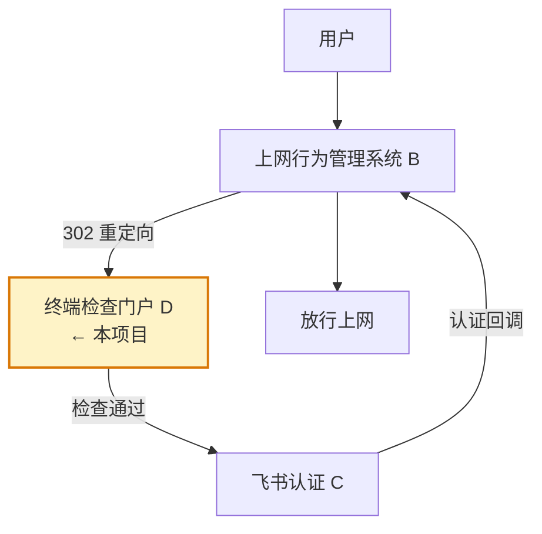
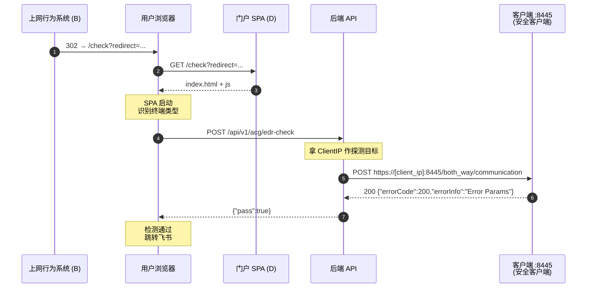
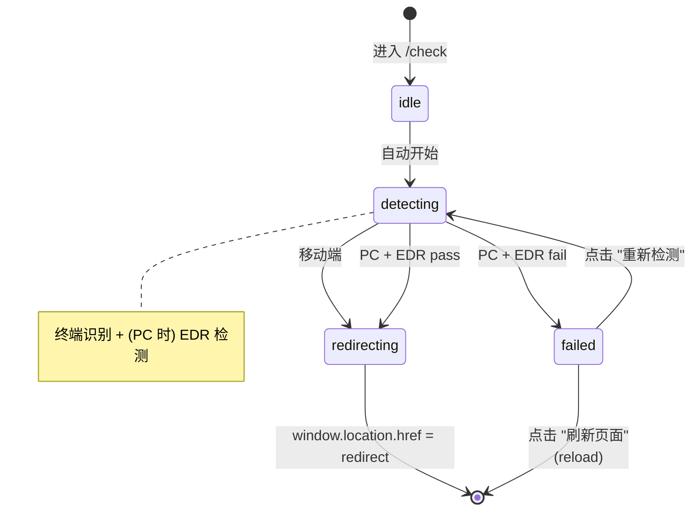
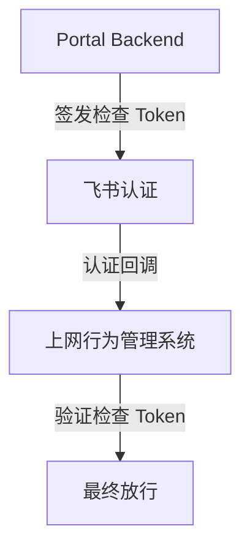

# EDR 预认证检查门户 (Pre-Authentication Check Portal)

> 挂在飞书认证之前、对 PC 终端做 EDR 合规检查的纯前端门户。
> 检查通过 → 跳转飞书认证；失败 → 阻断并提示安装/启动 EDR。

## 目录

1. [项目定位](#1-项目定位)
2. [MVP 范围](#2-mvp-范围)
3. [技术栈](#3-技术栈)
4. [部署架构（关键前提）](#4-部署架构关键前提)
5. [路由设计](#5-路由设计)
6. [业务流程（状态机）](#6-业务流程状态机)
7. [终端识别](#7-终端识别)
8. [EDR 检测方案](#8-edr-检测方案)
9. [页面 / 组件](#9-页面--组件)
10. [目录结构](#10-目录结构)
11. [本地开发与调试](#11-本地开发与调试)
12. [测试矩阵](#12-测试矩阵)
13. [构建与部署](#13-构建与部署)
14. [后续规划](#14-后续规划)

---

## 1. 项目定位

本项目是认证链路中的 **D 系统**，负责在用户进入飞书认证之前对终端做安全合规检查。



**D 系统职责**

- 判断终端是 PC（Mac / Windows）还是移动端
- PC（Mac 与 Windows 一视同仁）：由后端反向探测客户端 `https://[client_ip]:8445/both_way/communication`，按 `status 200 + JSON errorCode==200` 判定终端安全客户端是否在运行
- 移动端：**视同免检**直接放行
- 通过 → 跳转飞书认证 URL
- 失败 → 显示阻断页，提示用户安装或启动安全客户端

---

## 2. MVP 范围

| 包含                                   | 不包含（留给后续生产版本） |
| -------------------------------------- | -------------------------- |
| PC（Mac/Win）/ 移动端判断              | 状态存储                   |
| 后端反探 8445 安全客户端端口（PC 端）  | 审计日志、用户管理         |
| 失败阻断页                             | Token 签发                 |
| 跳转飞书认证                           |                            |

---

## 3. 技术栈

| 类型     | 选型                  |
| -------- | --------------------- |
| 框架     | React 18 + TypeScript |
| 构建     | Vite                  |
| 路由     | react-router-dom v6   |
| 样式     | Tailwind CSS          |
| 部署形态 | 纯静态 SPA（无后端）  |
| 包管理器 | npm                   |

**实现原则**

1. 函数组件 + Hooks
2. 不引入重量级状态管理（`useState` / `useReducer` 足够）
3. 所有检测逻辑、浏览器判断封装为独立模块（`src/lib/`）
4. 所有状态用 TypeScript 类型显式定义
5. 优先保证兼容性与稳定性，而非炫酷效果

---

## 4. 部署架构（关键前提）

> ⚠️ EDR 检测**由后端代探**：浏览器调 `/api/v1/acg/edr-check`，后端拿请求方 ClientIP 反向请求 `https://[client_ip]:8445/both_way/communication`，按 200 + JSON `errorCode==200` 判定。
>
> 浏览器侧不再直接 fetch 客户端端口（CORS + 自签证书 + no-cors opaque 三重阻挡，前端读不到 status/body）。

### 4.1 部署形态

- 门户 SPA（本项目）：中心化或本地托管均可
- 后端 API（`apps/api`）：暴露 `/api/v1/acg/edr-check`，需要能反向到达员工 PC 的 8445 端口
- 员工 PC：运行安全客户端，监听 8445（HTTPS，通常自签证书）

### 4.2 用户访问链路



### 4.3 为什么这么设计

- 后端代探绕开浏览器对 CORS / 自签 HTTPS / no-cors opaque 的限制，能拿到完整 status 与 body，判定更稳。
- 8445 是 HTTPS 自签端口，后端 `InsecureSkipVerify` 仅用于"端口可达性 + 响应结构"探测，不传敏感数据。

---

## 5. 路由设计

使用 `react-router-dom`：

| 路径      | 组件             | 说明                                                      |
| --------- | ---------------- | --------------------------------------------------------- |
| `/check`  | `CheckPage`      | 入口，承接 `?redirect=<feishu_url>`，执行检测主流程       |
| `/failed` | `FailedPage`     | 检查失败的阻断页（"重新检测"会跳回 `/check`）             |
| `*`       | 重定向到 `/check` | 兜底                                                      |

### URL 参数

- `redirect`（必填）：飞书认证 URL
  - **MVP 不做白名单校验**，原样执行 `window.location.href = redirect`
  - 缺失时：显示静态错误"参数 redirect 缺失"，**不进入检测流程**

---

## 6. 业务流程（状态机）



**关键决策点**

| 终端              | EDR 检测 | 结果         |
| ----------------- | -------- | ------------ |
| 移动端            | 跳过     | 直接跳飞书   |
| Mac + 通过        | 执行     | 直接跳飞书   |
| Mac + 失败        | 执行     | 进 `/failed` |
| Windows + 通过    | 执行     | 直接跳飞书   |
| Windows + 失败    | 执行     | 进 `/failed` |

---

## 7. 终端识别

### 7.1 目标类型

```typescript
// src/lib/runtime.ts
export interface RuntimeInfo {
  isPC: boolean       // Windows（需要 EDR 检测）
  isMac: boolean      // macOS（需要 EDR 检测，与 PC 一致）
  isMobile: boolean   // 移动端，视同免检
  isFeishu: boolean   // 仅作环境标识，不参与 PC/Mac/移动端判断
}

export function detectRuntime(): RuntimeInfo
```

### 7.2 判断原则

不能只依赖 `navigator.userAgent`。结合以下信号综合判断：

```typescript
navigator.userAgent
navigator.userAgentData                  // Chromium 系，含 platform: "Windows" | "macOS"
navigator.maxTouchPoints                 // 触屏数量
window.matchMedia('(pointer: coarse)')   // 粗指针（手指）
window.matchMedia('(hover: none)')       // 不支持 hover
```

**规则**：

1. 先判 Mobile（触屏特征明显 → `Mobile`）
2. 再判 Mac（`userAgentData.platform === 'macOS'` 或 UA 含 `Macintosh|Mac OS X`）
3. 否则视为 `PC`（Windows 等需要 EDR）

> ⚠️ **iPadOS Safari 陷阱**：iPad 默认请求"桌面网站"，UA 写成 `Macintosh; Intel Mac OS X`，看起来跟 Mac 一样。必须**先判 Mobile 再判 Mac**——iPad 的触屏信号会先把它归到 Mobile，避免被误判为 Mac。

### 7.3 飞书环境识别

```typescript
const isFeishu = /Lark|Feishu|LarkLocale|Lark\/|Feishu\//i.test(navigator.userAgent)
```

> ⚠️ 飞书 PC 客户端也有内置浏览器，所以 `isFeishu === true` **不等于**移动端。`isFeishu` 仅用于环境标识、调试日志。

---

## 8. EDR 检测方案

### 8.1 检测目标

```
POST https://[client_ip]:8445/both_way/communication
```

判定通过的双重条件：

1. HTTP 状态码 == 200
2. 响应 body 为合法 JSON，且 `errorCode == 200`

实测客户端在监听时，对空 body 的 POST 会回：

```json
{"errorCode": 200, "errorInfo": "Error Params"}
```

`errorInfo` 的具体文案不参与判定（可能因版本差异）。

### 8.2 由后端代探的原因

浏览器侧直接 fetch 该端口同时撞三堵墙：

1. **跨源**：协议/端口不同，浏览器要求 CORS，但客户端不会回 CORS 头。
2. **自签证书**：8445 通常是自签 HTTPS，浏览器在无用户预授权时直接拒绝握手。
3. **no-cors opaque**：即使绕回 `no-cors`，Response 也是 opaque，`status` 永远为 0、headers/body 一律读不到，根本拿不到 `errorCode`。

因此浏览器侧不再尝试直探。流程改为：

```
浏览器 ─POST─► 门户后端 /api/v1/acg/edr-check
                 │
                 │ 拿 ClientIP 作探测目标
                 ▼
        POST https://[ClientIP]:8445/both_way/communication
                 │
                 │ 校验 status 200 && errorCode==200
                 ▼
        {"pass": true|false, "reason": "..."}
                 │
                 ▼
              浏览器
```

### 8.3 后端实现要点

代码位于 `apps/api/internal/service/acg.go`：

- HTTP 客户端 `InsecureSkipVerify: true`：探测仅校验端口可达 + 响应结构，不传敏感数据，自签证书无需信任链。
- 关闭 keep-alive，避免向不同 PC 客户端的连接被串用。
- 不跟随重定向，按原始响应判定。
- IP 规范化：`::1` → `127.0.0.1`，`::ffff:1.2.3.4` → `1.2.3.4`，避免 dual-stack 监听把 IPv6 喂给只监听 IPv4 的客户端。
- 超时、连接拒绝、TLS 握手失败 → `Pass=false`（不是 error），error 仅留给"参数非法"等编程错误。

### 8.4 前端封装

```typescript
// src/lib/edr.ts
export type EdrResult = 'pass' | 'fail'

export async function checkEdr(opts: EdrCheckOptions = {}): Promise<EdrResult>
```

前端调 `POST /api/v1/acg/edr-check`，按响应 `pass` 字段返回 `'pass'|'fail'`；网络层异常一律算 `'fail'`。

---

## 9. 页面 / 组件

### 9.1 CheckPage（`/check`）

**行为**：进入即开始执行 → 终端识别 → (PC) EDR 检测 → 跳转或进 `/failed`。

**UI 布局**

```
┌─────────────────────────────────┐
│                                 │
│        [ 旋转 Loading ]         │
│                                 │
│   正在检查终端安全状态...       │
│                                 │
└─────────────────────────────────┘
```

**边界场景**

- `redirect` 参数缺失 → 显示静态错误"参数 redirect 缺失，请联系管理员"，不开始检测
- 移动端 → 立即跳转，不显示 Loading（或仅极短显示）

### 9.2 FailedPage（`/failed`）

**UI 布局**

```
┌─────────────────────────────────────────────┐
│                                             │
│   ⚠  终端安全检查未通过                     │
│                                             │
│   未检测到企业安全客户端。                  │
│   请安装或启动公司终端安全客户端，          │
│   完成后点击下方按钮重新检测。              │
│                                             │
│   [ 重新检测 ]    [ 刷新页面 ]              │
│                                             │
└─────────────────────────────────────────────┘
```

**按钮行为**

| 按钮     | 行为                                                            |
| -------- | --------------------------------------------------------------- |
| 重新检测 | `navigate('/check' + window.location.search)`（保留 `redirect`）|
| 刷新页面 | `window.location.reload()`                                      |

> ⚠️ 不得自动跳转，也不得自动重试。

---

## 10. 目录结构

```
acg_checker/
├── index.html
├── vite.config.ts
├── tailwind.config.ts
├── postcss.config.js
├── tsconfig.json
├── package.json
├── public/
└── src/
    ├── main.tsx              # 入口，挂载 RouterProvider
    ├── router.tsx            # 路由表（/check, /failed, *）
    ├── App.tsx               # 全局壳（如有）
    ├── lib/
    │   ├── runtime.ts        # detectRuntime() → RuntimeInfo
    │   ├── edr.ts            # checkEdr() → EdrResult
    │   └── redirect.ts       # parseRedirectParam() / goRedirect()
    ├── pages/
    │   ├── CheckPage.tsx
    │   └── FailedPage.tsx
    ├── components/
    │   └── Spinner.tsx
    └── styles/
        └── index.css         # @tailwind base/components/utilities
```

---

## 11. 本地开发与调试

### 11.1 启动

```bash
npm install
npm run dev          # 默认端口 5173
```

### 11.2 EDR Mock（重要）

开发机一般是 macOS，没有 OfficeScan。通过环境变量 mock：

```bash
VITE_EDR_MOCK=pass npm run dev   # 模拟检查通过
VITE_EDR_MOCK=fail npm run dev   # 模拟检查失败
npm run dev                      # 不设变量 → 真实 fetch（默认）
```

`src/lib/edr.ts` 读取 `import.meta.env.VITE_EDR_MOCK`，命中 `pass`/`fail` 时直接返回，跳过真实 fetch。

### 11.3 终端识别 Mock

通过 URL 参数强制覆盖（仅 dev 环境生效，生产构建中剥掉），便于在一台机器上测三种分支：

```
http://localhost:5173/check?redirect=...&force=pc       # Windows，跑 EDR
http://localhost:5173/check?redirect=...&force=mac      # Mac，免检直跳
http://localhost:5173/check?redirect=...&force=mobile   # 移动端，免检直跳
```

实现：`detectRuntime()` 内读 `import.meta.env.DEV` + `URLSearchParams`。

### 11.4 调试日志

`src/lib/runtime.ts` 与 `src/lib/edr.ts` 在 `import.meta.env.DEV` 下输出 `console.info` 日志（输入信号、判定结果、耗时），生产构建不输出。

---

## 12. 测试矩阵

实现完成后需在以下环境验证：

| 类型     | 浏览器                       | 期望分支          |
| -------- | ---------------------------- | ----------------- |
| Windows  | Chrome (Windows)             | EDR 检测 → 跳飞书 |
| Windows  | Edge (Windows)               | EDR 检测 → 跳飞书 |
| Windows  | Firefox (Windows)            | EDR 检测 → 跳飞书 |
| Windows  | 飞书 PC 客户端内置浏览器     | EDR 检测 → 跳飞书 |
| Mac      | Safari (macOS)               | EDR 检测 → 跳飞书 |
| Mac      | Chrome (macOS)               | EDR 检测 → 跳飞书 |
| Mac      | 飞书 Mac 客户端内置浏览器    | EDR 检测 → 跳飞书 |
| 移动     | iPhone Safari                | 跳过 EDR → 跳飞书 |
| 移动     | iPad Safari（含"桌面网站"）  | 跳过 EDR → 跳飞书 |
| 移动     | Android Chrome               | 跳过 EDR → 跳飞书 |
| 移动     | 飞书移动端内置浏览器         | 跳过 EDR → 跳飞书 |

每个 PC 环境（Mac / Windows）分别验证两种 EDR 状态：

- 安全客户端运行中（8445 回 200 + `errorCode:200`） → `/check` Loading 后跳转 redirect
- 安全客户端停止 / 端口不通 → 进入 `/failed`

> 移动端**不应**跑 EDR、也不应进 `/failed`，需直接跳转 redirect。

---

## 13. 构建与部署

```bash
npm run build        # 产物在 dist/
```

部署步骤：

1. 门户 SPA：托管 `dist/`，配置 SPA fallback（所有未知路径 → `index.html`，react-router 需要）
2. 后端 API（`apps/api`）部署在能反向到达员工 PC 8445 端口的网络位置
3. 同源部署或在 SPA 注入 `VITE_API_BASE_URL` 指向后端
4. 上网行为管理系统 (B) 配置 302 目标：`<门户地址>/check?redirect=<urlencoded_feishu_auth_url>`

---

## 14. 后续规划

当前 MVP 仅做前端检查，存在用户可绕过的风险。正式生产版本应增加 Token 签发与回调校验：



本项目**当前阶段不实现**该能力。
